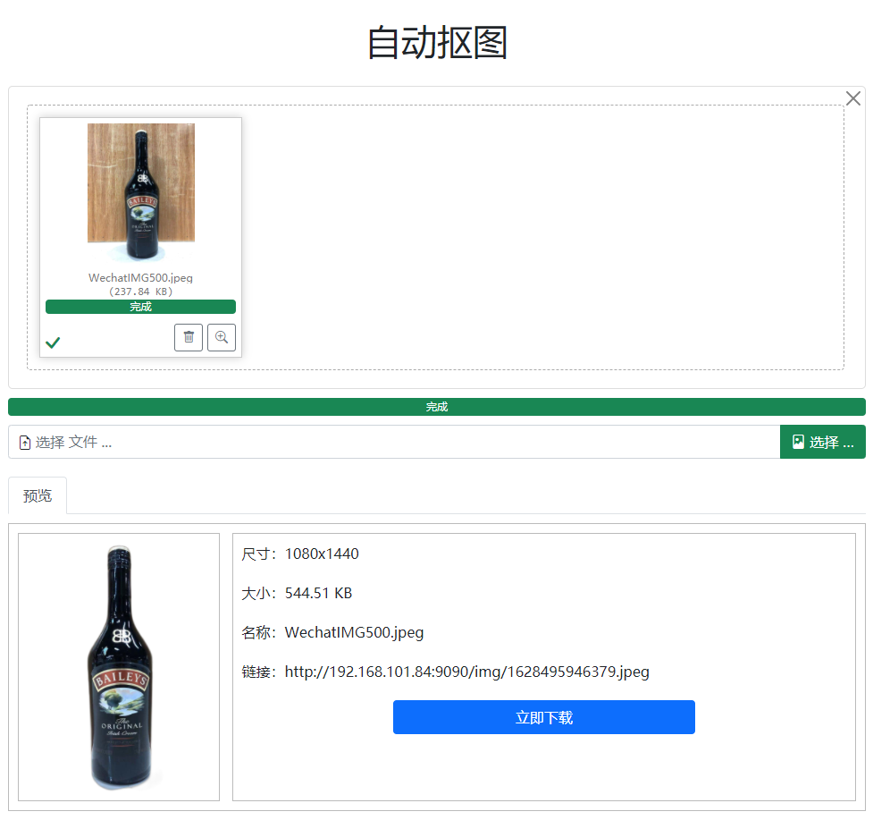

# matting
自动抠图 消除背景

## 演示图

## 要求
* python 3.8 或更高
* torch 和 torchvision 稳定版（https://pytorch.org）
* JDK 1.8 或更高

#### 安装torch：
```shell script
pip install torch==1.7.1+cpu torchvision==0.8.2+cpu -f https://download.pytorch.org/whl/torch_stable.html
```
#### 安装rembg
```shell script
pip install rembg
```
#### 安装u2net
链接：https://pan.baidu.com/s/1ZCSZSHvoHdigGqFD170r2w 
提取码：6cgj
将下载下来的u2net.pth保存到用户目录的.u2net文件夹中

##参考
* https://github.com/danielgatis/rembg
* https://github.com/kartik-v/bootstrap-fileinput